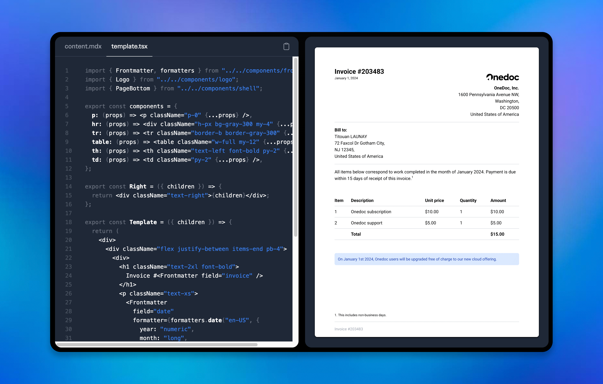

<Note>
  We are currently in **public Beta**. Our team is diligently working to
  provide a robust and secure product for you. For any inquiries, please contact
  our [**support
  team**](mailto:contact@onedoclabs.com?subject=Support%20request&body=Describe%20your%20issue%20and%20our%20team%20will%20get%20back%20to%20you%20as%20soon%20as%20possible.) !
</Note>

{" "}

<Frame>
  
</Frame>

Onedoc is an innovative API solution for developers, offering a simple and secure way to create and manage PDF documents using familiar technologies like React.

## Quick Start

Learn how to get Onedoc set up in your project as easy as 1,2,3.

<Steps>
  <Step title="Sign-up and get your API Key">
    Set up your Onedoc account and request your API Key.
  </Step>
  <Step title="Create your template">
    Create your first template using your favorite progamming language.
  </Step>
  <Step title="Generate your PDF">
    Make your first call to our API and generate your PDF instantly.
  </Step>
</Steps>

<CardGroup cols={2}>
  <Card
    title="Node.js"
    icon={
      <svg viewBox="0 0 128 128">
        <path
          fill="#83CD29"
          d="M112.771 30.334L68.674 4.729c-2.781-1.584-6.402-1.584-9.205 0L14.901 30.334C12.031 31.985 10 35.088 10 38.407v51.142c0 3.319 2.084 6.423 4.954 8.083l11.775 6.688c5.628 2.772 7.617 2.772 10.178 2.772 8.333 0 13.093-5.039 13.093-13.828v-50.49c0-.713-.371-1.774-1.071-1.774h-5.623C42.594 41 41 42.061 41 42.773v50.49c0 3.896-3.524 7.773-10.11 4.48L18.723 90.73c-.424-.23-.723-.693-.723-1.181V38.407c0-.482.555-.966.982-1.213l44.424-25.561c.415-.235 1.025-.235 1.439 0l43.882 25.555c.42.253.272.722.272 1.219v51.142c0 .488.183.963-.232 1.198l-44.086 25.576c-.378.227-.847.227-1.261 0l-11.307-6.749c-.341-.198-.746-.269-1.073-.086-3.146 1.783-3.726 2.02-6.677 3.043-.726.253-1.797.692.41 1.929l14.798 8.754a9.294 9.294 0 004.647 1.246c1.642 0 3.25-.426 4.667-1.246l43.885-25.582c2.87-1.672 4.23-4.764 4.23-8.083V38.407c0-3.319-1.36-6.414-4.229-8.073zM77.91 81.445c-11.726 0-14.309-3.235-15.17-9.066-.1-.628-.633-1.379-1.272-1.379h-5.731c-.709 0-1.279.86-1.279 1.566 0 7.466 4.059 16.512 23.453 16.512 14.039 0 22.088-5.455 22.088-15.109 0-9.572-6.467-12.084-20.082-13.886-13.762-1.819-15.16-2.738-15.16-5.962 0-2.658 1.184-6.203 11.374-6.203 9.105 0 12.461 1.954 13.842 8.091.118.577.645.991 1.24.991h5.754c.354 0 .692-.143.94-.396.24-.272.367-.613.335-.979-.891-10.568-7.912-15.493-22.112-15.493-12.631 0-20.166 5.334-20.166 14.275 0 9.698 7.497 12.378 19.622 13.577 14.505 1.422 15.633 3.542 15.633 6.395 0 4.955-3.978 7.066-13.309 7.066z"
        ></path>
      </svg>
    }
    href="/quickstart/nodejs"
  >
    Set up Onedoc in your Node.js project using basic HTML
  </Card>
  <Card
    title="React"
    icon={
            <svg viewBox="0 0 128 128">
            <g fill="#61DAFB"><circle cx="64" cy="64" r="11.4"></circle><path d="M107.3 45.2c-2.2-.8-4.5-1.6-6.9-2.3.6-2.4 1.1-4.8 1.5-7.1 2.1-13.2-.2-22.5-6.6-26.1-1.9-1.1-4-1.6-6.4-1.6-7 0-15.9 5.2-24.9 13.9-9-8.7-17.9-13.9-24.9-13.9-2.4 0-4.5.5-6.4 1.6-6.4 3.7-8.7 13-6.6 26.1.4 2.3.9 4.7 1.5 7.1-2.4.7-4.7 1.4-6.9 2.3C8.2 50 1.4 56.6 1.4 64s6.9 14 19.3 18.8c2.2.8 4.5 1.6 6.9 2.3-.6 2.4-1.1 4.8-1.5 7.1-2.1 13.2.2 22.5 6.6 26.1 1.9 1.1 4 1.6 6.4 1.6 7.1 0 16-5.2 24.9-13.9 9 8.7 17.9 13.9 24.9 13.9 2.4 0 4.5-.5 6.4-1.6 6.4-3.7 8.7-13 6.6-26.1-.4-2.3-.9-4.7-1.5-7.1 2.4-.7 4.7-1.4 6.9-2.3 12.5-4.8 19.3-11.4 19.3-18.8s-6.8-14-19.3-18.8zM92.5 14.7c4.1 2.4 5.5 9.8 3.8 20.3-.3 2.1-.8 4.3-1.4 6.6-5.2-1.2-10.7-2-16.5-2.5-3.4-4.8-6.9-9.1-10.4-13 7.4-7.3 14.9-12.3 21-12.3 1.3 0 2.5.3 3.5.9zM81.3 74c-1.8 3.2-3.9 6.4-6.1 9.6-3.7.3-7.4.4-11.2.4-3.9 0-7.6-.1-11.2-.4-2.2-3.2-4.2-6.4-6-9.6-1.9-3.3-3.7-6.7-5.3-10 1.6-3.3 3.4-6.7 5.3-10 1.8-3.2 3.9-6.4 6.1-9.6 3.7-.3 7.4-.4 11.2-.4 3.9 0 7.6.1 11.2.4 2.2 3.2 4.2 6.4 6 9.6 1.9 3.3 3.7 6.7 5.3 10-1.7 3.3-3.4 6.6-5.3 10zm8.3-3.3c1.5 3.5 2.7 6.9 3.8 10.3-3.4.8-7 1.4-10.8 1.9 1.2-1.9 2.5-3.9 3.6-6 1.2-2.1 2.3-4.2 3.4-6.2zM64 97.8c-2.4-2.6-4.7-5.4-6.9-8.3 2.3.1 4.6.2 6.9.2 2.3 0 4.6-.1 6.9-.2-2.2 2.9-4.5 5.7-6.9 8.3zm-18.6-15c-3.8-.5-7.4-1.1-10.8-1.9 1.1-3.3 2.3-6.8 3.8-10.3 1.1 2 2.2 4.1 3.4 6.1 1.2 2.2 2.4 4.1 3.6 6.1zm-7-25.5c-1.5-3.5-2.7-6.9-3.8-10.3 3.4-.8 7-1.4 10.8-1.9-1.2 1.9-2.5 3.9-3.6 6-1.2 2.1-2.3 4.2-3.4 6.2zM64 30.2c2.4 2.6 4.7 5.4 6.9 8.3-2.3-.1-4.6-.2-6.9-.2-2.3 0-4.6.1-6.9.2 2.2-2.9 4.5-5.7 6.9-8.3zm22.2 21l-3.6-6c3.8.5 7.4 1.1 10.8 1.9-1.1 3.3-2.3 6.8-3.8 10.3-1.1-2.1-2.2-4.2-3.4-6.2zM31.7 35c-1.7-10.5-.3-17.9 3.8-20.3 1-.6 2.2-.9 3.5-.9 6 0 13.5 4.9 21 12.3-3.5 3.8-7 8.2-10.4 13-5.8.5-11.3 1.4-16.5 2.5-.6-2.3-1-4.5-1.4-6.6zM7 64c0-4.7 5.7-9.7 15.7-13.4 2-.8 4.2-1.5 6.4-2.1 1.6 5 3.6 10.3 6 15.6-2.4 5.3-4.5 10.5-6 15.5C15.3 75.6 7 69.6 7 64zm28.5 49.3c-4.1-2.4-5.5-9.8-3.8-20.3.3-2.1.8-4.3 1.4-6.6 5.2 1.2 10.7 2 16.5 2.5 3.4 4.8 6.9 9.1 10.4 13-7.4 7.3-14.9 12.3-21 12.3-1.3 0-2.5-.3-3.5-.9zM96.3 93c1.7 10.5.3 17.9-3.8 20.3-1 .6-2.2.9-3.5.9-6 0-13.5-4.9-21-12.3 3.5-3.8 7-8.2 10.4-13 5.8-.5 11.3-1.4 16.5-2.5.6 2.3 1 4.5 1.4 6.6zm9-15.6c-2 .8-4.2 1.5-6.4 2.1-1.6-5-3.6-10.3-6-15.6 2.4-5.3 4.5-10.5 6-15.5 13.8 4 22.1 10 22.1 15.6 0 4.7-5.8 9.7-15.7 13.4z"></path></g>
            </svg>
          
    }
    href="/quickstart/nodejs-react"
  >
    Set up Onedoc in your Node.js project using React Components
  </Card>

  <Card
    title="CodeSandbox"
    icon={
            <svg viewBox="0 0 16 16" xmlns="http://www.w3.org/2000/svg" class="c-jTwhQQ c-jTwhQQ-iefyCvf-css logo" aria-hidden="true"><path clip-rule="evenodd" d="M2 2L14 2V14H2V2ZM12.7727 3.22727V12.7727H3.22727V3.22727H12.7727Z" fill="#CCCCCC" fill-rule="evenodd"></path></svg>
          
    }
    href="https://codesandbox.io/p/devbox/onedoc-template-invoice-forked-jdyw6j?embed=1&file=%2Findex.tsx"
    target="blank"
  >
    Want to get started without a project ? Try out our simple CodeSandbox
  </Card>
</CardGroup>

## Ressources

Seeking information? Explore our FAQ section, delve into details about our SDKs and integrations, or discover how we prioritize security.

<CardGroup cols={2}>
  <Card
    title="FAQ"
    icon="question"
    href="/ressources/faq"
  >
    Frequently asked questions
  </Card>

{" "}

<Card title="SDKs" icon="dev" href="/ressources/sdks">
  Onedoc & Community SDKs
</Card>

{" "}

<Card title="Security" icon="shield-halved" href="/ressources/security">
  Onedoc's security practices
</Card>

  <Card
    title="Integrations"
    icon="circle-nodes"
    href="/ressources/integrations"
  >
    Onedoc & Community SDKs
  </Card>
</CardGroup>
